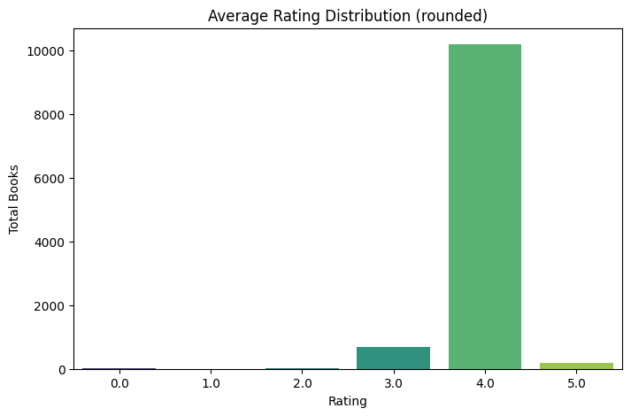
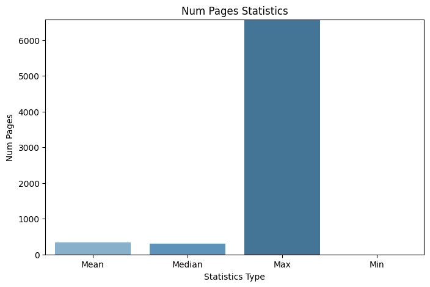
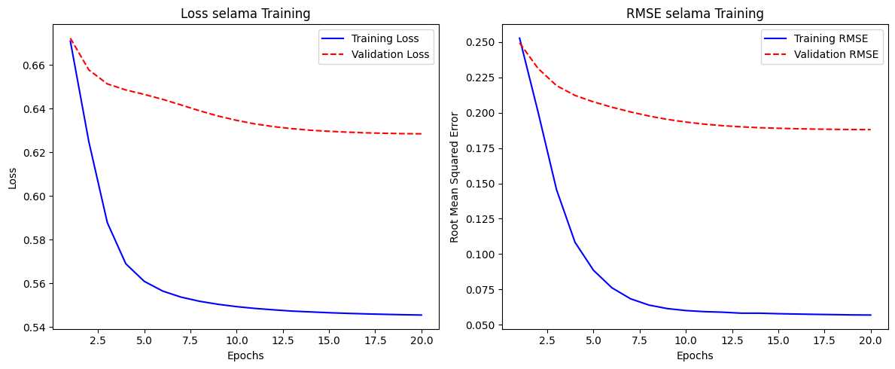

# Laporan Proyek Machine Learning Sistem Rekomendasi Buku - Muhammad Nandaarjuna Fadhillah

## **Project Overview**

### Latar Belakang dan Hasil Riset Penelitian

Perkembangan teknologi informasi dan komunikasi telah membawa transformasi besar dalam cara masyarakat mengakses informasi dan literatur [1]. Di tengah melimpahnya sumber bacaan digital seperti perpustakaan daring dan toko buku online, pengguna justru sering kesulitan menemukan bacaan yang sesuai dengan minat mereka [1]. Untuk mengatasi hal ini, sistem rekomendasi menjadi solusi yang penting [1]. Sistem ini, yang merupakan bagian dari kecerdasan buatan (AI), bekerja dengan menganalisis data dan perilaku pengguna guna memberikan saran yang relevan. Salah satu metode yang banyak digunakan adalah collaborative filtering, terutama pendekatan user-based yang merekomendasikan buku berdasarkan kesamaan preferensi antar pengguna [1].

Penelitian ini mengembangkan sistem rekomendasi buku berbasis user-based collaborative filtering dengan menggunakan dataset fiktif yang disimulasikan dari interaksi pengguna terhadap berbagai judul buku [1]. Sistem ini dievaluasi menggunakan metrik Mean Absolute Error (MAE) untuk menilai akurasi prediksi, serta diuji melalui antarmuka pengguna guna mengukur kemudahan penggunaan dan tingkat kepuasan [1]. Diharapkan sistem ini dapat mendukung aktivitas belajar di lingkungan pendidikan dan membantu siswa dalam menemukan bacaan yang sesuai, sekaligus memberikan wawasan bagi pustakawan dalam mengelola koleksi buku [1]. Secara keseluruhan, sistem rekomendasi ini berpotensi meningkatkan personalisasi dan aksesibilitas informasi literasi dalam ekosistem digital yang inklusif dan adaptif [1].

Hasil penelitian ini menunjukkan bahwa sistem rekomendasi buku berbasis user-based collaborative filtering berhasil dikembangkan dan diuji menggunakan dataset simulasi dari lingkungan perpustakaan sekolah [1]. Sistem ini mampu memberikan saran bacaan berdasarkan kesamaan preferensi antar pengguna, dengan performa yang cukup baik, terbukti dari nilai Mean Absolute Error (MAE) sebesar 0,71 yang menunjukkan prediksi cukup mendekati nilai rating aktual [1]. Uji coba terhadap pengguna juga menunjukkan respons positif terhadap kualitas rekomendasi yang diberikan, dan sistem ini terbukti membantu pengguna dalam menemukan buku yang sesuai minat mereka, serta berkontribusi terhadap peningkatan literasi dan minat baca di lingkungan digital [1].

Referensi :

[1] Pratama, S. A. (2024). "Development Of A Book Recommendation System Using Collaborative Filtering". *Jurnal Komputer*, 2(2), 81–86. https://doi.org/10.70963/jk.v2i2.112

## **Business Understanding**
Menjelaskan proses klarifikasi masalah

### 🧩 Problem Statements
Berikut merupakan permasalahan yang akan diselesaikan pada proyek ini :
1. Bagaimana sistem dapat memberikan rekomendasi buku yang relevan kepada pengguna berdasarkan preferensi atau minat pengguna sebelumnya?
2. Metode dan teknik apa yang paling efektif dalam mengukur kemiripan antara buku agar sistem dapat memberikan hasil rekomendasi yang optimal?
3. Bagaimana mengukur efektivitas sistem rekomendasi yang dibangun dalam memberikan saran buku yang sesuai dengan minat pengguna?

### 🎯 Goals
Menjelaskan tujuan dari permasalahan yang didapat:
1. Membangun sistem rekomendasi buku yang dapat memberikan saran buku yang relevan berdasarkan konten seperti penulis, dan bahasa.
2. Mengimplementasikan metode Content-Based Filtering dan Collaborative Filtering untuk menghitung kemiripan antar buku dan hubungan antar pengguna.
3. Mengevaluasi performa sistem dengan metrik evaluasi seperti precision, loss, dan RMSE untuk mengukur efektivitas rekomendasi yang diberikan.

### 💡 Solution Statements
1. Pengembangan Sistem Rekomendasi:
    - Membangun sistem rekomendasi dengan pendekatan Content-Based Filtering (CBF) dan Collaborative Filtering (CF) berbasis deep learning.
2. Solusi untuk Pengukuran Kemiripan:
    - Menggunakan Cosine Similarity untuk mengukur kemiripan antar buku dalam pendekatan CBF.
    - Pada CF, mensimulasikan data pengguna dan membangun model neural network untuk memprediksi preferensi pengguna terhadap buku.
3. Solusi untuk Evaluasi Sistem Rekomendasi:
    - Evaluasi sistem dilakukan dengan mengukur precision untuk CBF dan visualisasi loss serta RMSE untuk CF.
    - Uji coba dilakukan dengan menginput buku acuan dan pengguna acak untuk melihat rekomendasi yang dihasilkan.

## **Data Understanding**
- **Jumlah Baris = 11123**
- **Jumlah Kolom = 12**

### Deskripsi Dataset
Dalam dataset ini, yang dikumpulkan dengan bantuan situs Goodbook, diperoleh berbagai informasi mengenai buku, seperti nama penulis, jumlah halaman, rating, dan informasi penting lainnya. Selain itu, dari data yang tersedia ini, juga dapat membangun sebuah sistem rekomendasi yang bertujuan untuk menyarankan buku-buku kepada pengguna, sehingga dapat membantu mereka dalam membuat keputusan yang lebih baik dalam memilih buku yang sesuai dengan minat atau preferensinya.

Sumber Dataset: [Book Recommendation (Good book api)](https://www.kaggle.com/datasets/imtkaggleteam/book-recommendation-good-book-api)

### Variabel-variabel pada "Book Recommendation (Good book api) Dataset"
Variabel yang ada pada dataset ini antara lain:
1. bookID              : Merupakan ID unik yang digunakan untuk mengidentifikasi setiap buku dalam dataset.
2. title               : udul dari buku yang tercantum dalam dataset.
3. authors             : Nama penulis atau pengarang dari buku.
4. average_rating      : Rata-rata penilaian atau rating yang diberikan oleh para pembaca terhadap buku tersebut.
5. isbn Nomor ISBN     : (International Standard Book Number), yaitu kode angka unik yang digunakan secara komersial untuk mengidentifikasi buku.
6. isbn13              : Versi 13 digit dari ISBN yang diperkenalkan untuk meningkatkan ketersediaan ISBN secara global.
7. language_code       : Kode bahasa yang menunjukkan bahasa tulisan dari setiap buku.
8. num_pages           : Jumlah halaman utama yang terdapat dalam buku.
9. ratings_count       : Jumlah penilaian unik yang diterima oleh buku dari para pembaca.
10. text_reviews_count : Jumlah total ulasan berbentuk teks yang diberikan oleh pembaca terhadap buku tersebut.
11. publication_date   : Tanggal buku di publikasikan
12. publisher          : Penerbit buku

### Kondisi Data

1. Missing Value

    Missing Value (Nilai yang Hilang) mengacu pada data yang tidak tercatat atau tidak tersedia dalam dataset. 
    ```
    print("\nMissing Values per Column:")
    for col in dataset_cleaned.columns:
        print(f"{col:20} : {dataset_cleaned[col].isna().sum()}")
    ```
    output:
    ```
    Missing Values per Column:
    bookID               : 0
    title                : 0
    authors              : 0
    average_rating       : 0
    isbn                 : 0
    isbn13               : 0
    language_code        : 0
    num_pages          : 0
    ratings_count        : 0
    text_reviews_count   : 0
    publication_date     : 0
    publisher            : 0
    ```

2. Duplicated Data

    Duplicated Data mengacu pada catatan (baris/record) dalam dataset yang memiliki nilai identik atau hampir identik pada seluruh atau sebagian kolom.
    ```
    print("\nDataset Duplicated:")
    display(dataset_cleaned.duplicated().sum())
    ```
    output:
    ```
    Dataset Duplicated:
    np.int64(0)
    ```

3. Outlier

    Outlier adalah data point yang secara signifikan berbeda dari mayoritas data dalam sebuah dataset.
    ```
    numerical_columns = prep_df.select_dtypes(include=["int64", "float64"]).columns
    # detect outlier with IQR methods
    def detect_outliers_iqr(data, column):
        Q1 = data[column].quantile(0.25)
        Q3 = data[column].quantile(0.75)
        IQR = Q3 - Q1
        lower_bound = Q1 - 1.5 * IQR
        upper_bound = Q3 + 1.5 * IQR
        outliers = data[(data[column] < lower_bound) | (data[column] > upper_bound)]
        return outliers

    for i, col in enumerate(numerical_columns):
        # Outlier detection
        outliers = detect_outliers_iqr(prep_df, col)
        print(f"{col}: {len(outliers)} outlier found")
    ```
    output:
    ```
    bookID: 0 outlier found
    average_rating: 237 outlier found
    isbn13: 975 outlier found
    num_pages: 540 outlier found
    ratings_count: 1728 outlier found
    text_reviews_count: 1630 outlier found
    ```
    didapatkan outlier di beberapa kolom, dan dilakukan pengecekan nilai/value pada tiap kolom yang relevan untuk dilakukan persiapan data, seperti berikut:
    ```
    for col in prep_df.columns:
        print(f"Unique values in {col}:")
        print(prep_df[col].unique())
        print("\n")
    ```
    output kolom yang relevan:
    ```
    Unique values in average_rating:
    [4.57 4.49 4.42 4.56 4.78 3.74 4.73 4.38 4.22 4.21 3.44 3.87 4.07 3.9
    3.83 3.86 3.91 3.93 4.59 4.5  4.36 4.53 3.84 3.72 4.   3.88 4.33 3.45
    3.76 3.6  4.06 4.17 3.55 3.98 4.13 3.95 4.24 4.34 3.92 4.23 3.75 3.94
    3.77 4.46 3.68 3.99 3.25 3.89 3.82 3.78 4.01 4.35 4.28 3.34 3.67 3.48
    3.5  3.62 4.27 3.39 4.12 4.08 4.05 3.85 2.99 4.19 3.71 4.2  3.65 3.4
    4.11 3.42 4.02 3.69 4.1  3.66 4.61 4.04 3.97 4.14 3.57 3.43 3.22 3.64
    3.96 3.8  3.81 3.79 3.23 4.15 4.39 4.03 3.73 3.51 3.63 3.09 3.59 4.29
    0.   4.25 4.26 3.61 4.16 4.55 4.52 3.41 4.7  4.18 3.58 4.51 3.15 3.31
    4.09 3.49 3.56 4.47 4.44 3.7  4.32 4.4  4.31 4.43 2.8  3.46 2.83 4.62
    2.67 4.45 4.3  5.   3.1  3.08 3.27 3.33 3.   4.67 4.63 3.52 3.36 3.54
    3.17 4.37 3.29 4.64 3.38 3.37 3.16 3.53 2.88 2.98 3.35 3.3  3.24 4.41
    4.48 4.54 4.6  3.32 3.13 2.   3.2  4.58 2.82 3.28 2.62 2.92 3.47 3.02
    1.   3.14 3.12 3.18 2.86 3.26 3.19 3.03 3.07 3.11 4.91 2.55 2.81 4.75
    3.21 4.71 4.8  2.72 2.79 2.96 2.75 4.86 4.65 2.5  4.82 4.76 4.72 4.69
    1.67 3.06 2.94 2.89 3.04 2.4  2.61 2.77 2.63 4.88 4.83 2.93 2.33]
    ```
    pada hasil diatas skor rating ada di antara 0-5 dan itu adalah hal yang wajar. Alasan Beberapa Nilai Dianggap Outlier:
    - Nilai Nol (0.0)
    * Karena rating umumnya diberikan dalam rentang 1.0 sampai 5.0. Nilai 0 kemungkinan besar menandakan buku tersebut belum pernah diberi rating, atau ada kesalahan dalam pencatatan data.
    - Nilai Sangat Rendah (< 2.0)
    * Jika hanya sedikit buku yang memiliki rating serendah ini, maka mereka menyimpang dari distribusi umum.
    - Nilai Sangat Tinggi (5.0)
    * jika hanya segelintir buku yang mencapai 5.0 rata-rata, nilai ini bisa juga dianggap outlier karena sangat langka atau terlalu sempurna untuk dianggap wajar.
    - Distribusi Rating Buku Cenderung Normal (Sekitar 3.5–4.5)
    * Jika mayoritas nilai ada di sekitar rentang ini, maka nilai di luar rentang ini terutama yang < 2.5 atau > 4.8 bisa dianggap menyimpang secara statistik.
    jadi, nilai outlier tersebut tidak perlu dihapus ataupun di ubah.

4. Informasi Data

    Ringkasan cepat (summary) tentang struktur dataset, termasuk tipe data, jumlah nilai non-null, dan penggunaan memori.
    ```
    print("\nDataset Information:")
    dataset_cleaned.info()
    ```
    output:
    ```
    Dataset Information:
    <class 'pandas.core.frame.DataFrame'>
    RangeIndex: 11123 entries, 0 to 11122
    Data columns (total 12 columns):
    #   Column              Non-Null Count  Dtype  
    ---  ------              --------------  -----  
    0   bookID              11123 non-null  int64  
    1   title               11123 non-null  object 
    2   authors             11123 non-null  object 
    3   average_rating      11123 non-null  float64
    4   isbn                11123 non-null  object 
    5   isbn13              11123 non-null  int64  
    6   language_code       11123 non-null  object 
    7     num_pages         11123 non-null  int64  
    8   ratings_count       11123 non-null  int64  
    9   text_reviews_count  11123 non-null  int64  
    10  publication_date    11123 non-null  object 
    11  publisher           11123 non-null  object 
    dtypes: float64(1), int64(5), object(6)
    memory usage: 1.0+ MB
    ```

### Exploratory Data Analysis (EDA)
Untuk memperoleh pemahaman yang lebih mendalam tentang data, dilakukan Analisis Data Eksplorasi (Exploratory Data Analysis/EDA)

1. Distribusi Statistik Rata-rata Rating (rounded)

    🔍 Insight dari Grafik:
    - Rating 4 mendominasi:
        - Sebagian besar buku memiliki rating rata-rata yang dibulatkan ke angka 4.
        - Ini mengindikasikan bahwa mayoritas pengguna memberi ulasan positif terhadap buku-buku tersebut.
    - Rating 3 juga cukup banyak:
        - Terdapat sejumlah buku yang berada di kisaran rating cukup baik.
    - Rating 5 sangat sedikit:
        - Buku yang menerima rating sempurna (5) sangat jarang.
        - Mungkin karena ekspektasi tinggi pengguna, sehingga sulit memberikan nilai maksimal.
    - Rating 0–2 hampir tidak ada:
        - Sangat sedikit buku yang mendapat nilai buruk.
        - Bisa jadi buku-buku dengan rating sangat rendah tidak terlalu populer atau jarang diulas

    📈 Kesimpulan:

    Distribusi ini menunjukkan bahwa pengguna cenderung memberi rating tinggi, dengan nilai paling umum adalah 4. Ini dapat menunjukkan kecenderungan pengguna untuk menyukai sebagian besar buku, atau bahwa buku-buku dalam dataset ini memang berkualitas baik.

    

2. Num Pages Statistik

    📍 Insight dari Barchart:
    - Max (nilai maksimum) sangat tinggi:
    - Terlihat paling mencolok. Ada buku dengan jumlah halaman lebih dari 6000, kemungkinan outlier atau buku dengan volume besar (misal ensiklopedia atau kompilasi).
    - Mean dan Median relatif mirip:
    - Rata-rata dan median berada di kisaran 300–400 halaman.
    - Ini mencerminkan panjang umum buku yang ada di dataset.
    - Min (nilai minimum) sangat rendah:
    - Hampir menyentuh 0 halaman, bisa jadi buku sangat tipis, buku kosong, atau data error/missing.

    📌 Kesimpulan:
    - Data menunjukkan bahwa kebanyakan buku memiliki panjang halaman yang wajar (sekitar 300-an).
    - Nilai maksimum sangat tinggi bisa mengindikasikan outlier yang perlu dipertimbangkan saat melakukan normalisasi data.

    

## **Data Preprocessing 🧹**
Pada bagian ini dilakukan beberapa tahapan preprocessing data, yaitu:

### Check CSV File dan Hapus Baris yang dianggap anomali
Tahapan ini dilakukan karena pada dataset csv ini, pandas membaca ada baris yang memiliki jumlah kolom yang tidak sesuai
```
with open(csv_path, 'r', encoding='utf-8') as file:
    for i, line in enumerate(file):
        fields = line.split(",")
        if len(fields) != 12:
            print(f"Line {i+1} has {len(fields)} fields: {line.strip()}")
```
output:
```
Line 3350 has 13 fields: 12224,Streetcar Suburbs: The Process of Growth in Boston  1870-1900,Sam Bass Warner, Jr./Sam B. Warner,3.58,0674842111,9780674842113,en-US,236,61,6,4/20/2004,Harvard University Press
Line 4704 has 13 fields: 16914,The Tolkien Fan's Medieval Reader,David E. Smith (Turgon of TheOneRing.net, one of the founding members of this Tolkien website)/Verlyn Flieger/Turgon (=David E. Smith),3.58,1593600119,9781593600112,eng,400,26,4,4/6/2004,Cold Spring Press
Line 5879 has 13 fields: 22128,Patriots (The Coming Collapse),James Wesley, Rawles,3.63,156384155X,9781563841552,eng,342,38,4,1/15/1999,Huntington House Publishers
Line 8981 has 13 fields: 34889,Brown's Star Atlas: Showing All The Bright Stars With Full Instructions How To Find And Use Them For Navigational Purposes And Department Of Trade Examinations.,Brown, Son & Ferguson,0.00,0851742718,9780851742717,eng,49,0,0,5/1/1977,Brown Son & Ferguson Ltd.
```
Selanjutnya, diatasi dengan menghapus baris yang tidak sesuai
```
input_path = csv_path
output_path = "cleaned_dataset.csv"

with open(input_path, 'r', encoding='utf-8') as infile, open(output_path, 'w', encoding='utf-8') as outfile:
    for i, line in enumerate(infile):
        fields = line.strip().split(",")
        if len(fields) == 12:
            outfile.write(line)
        else:
            print(f"Skipped line {i+1} with {len(fields)} fields.")
```
output:
```
Skipped line 3350 with 13 fields.
Skipped line 4704 with 13 fields.
Skipped line 5879 with 13 fields.
Skipped line 8981 with 13 fields.
```
setelah itu dataset yang telah di process akan di siapkan pada tahapan data preparation untuk kebutuhan model

## **Data Preparation**
Data preparation merupakan tahapan penting dalam proses pengembangan model content-based learning dan collaborative filtering. Pada bagian ini dilakukan beberapa tahapan persiapan data, yaitu:

### Dataset Awal 
Dilakukan copy dataset seperti dibawah ini, agar tidak mengganggu dataset aslinya
```
dataset_cleaned.columns = dataset_cleaned.columns.str.strip()
prep_df = dataset_cleaned.copy()
```
<table>
  <thead>
    <tr>
      <th>bookID</th>
      <th>title</th>
      <th>authors</th>
      <th>average_rating</th>
      <th>isbn</th>
      <th>isbn13</th>
      <th>language_code</th>
      <th>num_pages</th>
      <th>ratings_count</th>
      <th>text_reviews_count</th>
      <th>publication_date</th>
      <th>publisher</th>
    </tr>
  </thead>
  <tbody>
    <tr>
      <td>1</td>
      <td>Harry Potter and the Half-Blood Prince (Harry ...</td>
      <td>J.K. Rowling/Mary GrandPré</td>
      <td>4.57</td>
      <td>0439785960</td>
      <td>9780439785969</td>
      <td>eng</td>
      <td>652</td>
      <td>2095690</td>
      <td>27591</td>
      <td>9/16/2006</td>
      <td>Scholastic Inc.</td>
    </tr>
    <tr>
      <td>2</td>
      <td>Harry Potter and the Order of the Phoenix (Har...</td>
      <td>J.K. Rowling/Mary GrandPré</td>
      <td>4.49</td>
      <td>0439358078</td>
      <td>9780439358071</td>
      <td>eng</td>
      <td>870</td>
      <td>2153167</td>
      <td>29221</td>
      <td>9/1/2004</td>
      <td>Scholastic Inc.</td>
    </tr>
    <tr>
      <td>4</td>
      <td>Harry Potter and the Chamber of Secrets (Harry...</td>
      <td>J.K. Rowling</td>
      <td>4.42</td>
      <td>0439554896</td>
      <td>9780439554893</td>
      <td>eng</td>
      <td>352</td>
      <td>6333</td>
      <td>244</td>
      <td>11/1/2003</td>
      <td>Scholastic</td>
    </tr>
    <tr>
      <td>5</td>
      <td>Harry Potter and the Prisoner of Azkaban (Harr...</td>
      <td>J.K. Rowling/Mary GrandPré</td>
      <td>4.56</td>
      <td>043965548X</td>
      <td>9780439655484</td>
      <td>eng</td>
      <td>435</td>
      <td>2339585</td>
      <td>36325</td>
      <td>5/1/2004</td>
      <td>Scholastic Inc.</td>
    </tr>
    <tr>
      <td>8</td>
      <td>Harry Potter Boxed Set Books 1-5 (Harry Potte...</td>
      <td>J.K. Rowling/Mary GrandPré</td>
      <td>4.78</td>
      <td>0439682584</td>
      <td>9780439682589</td>
      <td>eng</td>
      <td>2690</td>
      <td>41428</td>
      <td>164</td>
      <td>9/13/2004</td>
      <td>Scholastic</td>
    </tr>
  </tbody>
</table>


### Menyiapkan data untuk kebutuhan model Content-Based Filtering
```
# solve irrelevant author
prep_df['authors_clean'] = prep_df['authors']\
    .str.split('/').str[0]\
    .str.lower()\
    .str.replace(r'[^a-zA-Z\s]', '', regex=True)\
    .str.replace(r'\s+', '_', regex=True)\
    .str.strip()

# rename language_codes
language_mapping = {
    'eng': 'English',
    'en-US': 'English United States',
    'fre': 'French',
    'spa': 'Spanish',
    'en-GB': 'English United Kingdom',
    'mul': 'Multiple languages',
    'grc': 'Ancient Greek',
    'enm': 'Early New English',
    'en-CA': 'English Canada',
    'ger': 'German',
    'jpn': 'Japanese',
    'ara': 'Arabic',
    'nl': 'Dutch',
    'zho': 'Chinese',
    'lat': 'Latin',
    'por': 'Portuguese',
    'srp': 'Serbian',
    'ita': 'Italian',
    'rus': 'Russian',
    'msa': 'Malay',
    'glg': 'Galician',
    'wel': 'Welsh',
    'swe': 'Swedish',
    'nor': 'Norwegian',
    'tur': 'Turkish',
    'gla': 'Gaelic Scotland',
    'ale': 'Aleut'
}
prep_df['languages'] = prep_df['language_code'].map(language_mapping)
prep_df['languages'] = prep_df['languages']\
    .str.lower()\
    .str.replace(r'[^a-zA-Z\s]', '', regex=True)\
    .str.replace(r'\s+', '_', regex=True)\
    .str.strip()

prep_df['combined_features'] = prep_df['languages'] + ' ' + prep_df['authors_clean']
prep_df = prep_df[prep_df['combined_features'].str.len() > 3]
prep_df['combined_features'] = prep_df['combined_features'].fillna('Unknown')

prep_df['combined_features'] = prep_df['combined_features']\
    .str.lower()\
    .str.replace(r'[^a-zA-Z\s]', '', regex=True)\
    .str.replace(r'\s+', '_', regex=True)\
    .str.strip()

cbf_df = prep_df[['title', 'combined_features', 'languages']]
cbf_df.head()
```
Pada tahapan ini bertujuan untuk membersihkan dan menyiapkan data sebelum membangun sistem rekomendasi berbasis konten (Content-Based Filtering) dari dataset buku:
1. Membersihkan Kolom authors : Membersihkan nama penulis agar seragam dan bisa dipakai sebagai fitur dalam sistem rekomendasi.
2. Mapping language_code ke Bahasa Lengkap : Mengubah kode bahasa `(eng, fre, dll)` menjadi nama bahasa yang bisa dimengerti pengguna.
3. Membersihkan Kolom languages : Membersihkan dan standarisasi nilai bahasa agar konsisten, sama seperti authors_clean.
4. Membuat Kolom Gabungan combined_features : Membuat fitur gabungan antara bahasa dan penulis yang bisa digunakan sebagai representasi konten untuk sistem rekomendasi.
5. Filter Nilai Kosong atau Kurang Bermakna : Agar tidak mengganggu dalam proses modeling
6. Membersihkan Kembali combined_features : Pastikan combined_features benar-benar bersih dan seragam sebelum dipakai untuk proses lebih lanjut seperti ekstraksi fitur.
7. Membuat DataFrame Final untuk CBF : Mengambil kolom yang relevan untuk sistem rekomendasi: `title: Judul buku,combined_features: Gabungan fitur penulis dan bahasa,languages: Bahasa buku`
output:
<table>
  <thead>
    <tr>
      <th>title</th>
      <th>combined_features</th>
      <th>languages</th>
    </tr>
  </thead>
  <tbody>
    <tr>
      <td>Harry Potter and the Half-Blood Prince (Harry ...</td>
      <td>english_jkrowling</td>
      <td>english</td>
    </tr>
    <tr>
      <td>Harry Potter and the Order of the Phoenix (Har...</td>
      <td>english_jkrowling</td>
      <td>english</td>
    </tr>
    <tr>
      <td>Harry Potter and the Chamber of Secrets (Harry...</td>
      <td>english_jkrowling</td>
      <td>english</td>
    </tr>
    <tr>
      <td>Harry Potter and the Prisoner of Azkaban (Harr...</td>
      <td>english_jkrowling</td>
      <td>english</td>
    </tr>
    <tr>
      <td>Harry Potter Boxed Set Books 1-5 (Harry Potte...</td>
      <td>english_jkrowling</td>
      <td>english</td>
    </tr>
  </tbody>
</table>

### Menyiapkan data untuk kebutuhan model Collaborative Filtering

1. Membuat user dummy

    karena dibutuhkan user untuk mendapatkan hasil rekomendasi dari user tertentu dan mendapatkan hubungan kolaborasi antar pengguna
    ```
    n_fake_users = 10
    simulated_data = []

    for _, row in prep_df.iterrows():
        book_id = row['bookID']
        avg_rating = row['average_rating']
        
        for _ in range(n_fake_users):
            user_id = f"user_{np.random.randint(10000)}"
            rating = np.clip(np.random.normal(loc=avg_rating, scale=0.5), 1.0, 5.0)
            simulated_data.append({
                'userID': user_id,
                'bookID': book_id,
                'rating': round(rating, 2)
            })

    cf_df = pd.DataFrame(simulated_data)
    cf_df.head()
    ```
    output:
    <table>
    <thead>
        <tr>
        <th>userID</th>
        <th>bookID</th>
        <th>rating</th>
        </tr>
    </thead>
    <tbody>
        <tr>
        <td>user_1881</td>
        <td>1</td>
        <td>4.43</td>
        </tr>
        <tr>
        <td>user_8556</td>
        <td>1</td>
        <td>4.83</td>
        </tr>
        <tr>
        <td>user_2728</td>
        <td>1</td>
        <td>4.68</td>
        </tr>
        <tr>
        <td>user_5806</td>
        <td>1</td>
        <td>3.64</td>
        </tr>
        <tr>
        <td>user_8057</td>
        <td>1</td>
        <td>4.80</td>
        </tr>
    </tbody>
    </table>

2. Encoding kolom `userID` dan `bookID` dan normalisasi kolom `rating`

    Pada tahapan ini dilakukan:
    - Transformasi ID user dan buku ke bentuk numerik.
    - Normalisasi rating ke dalam skala 0–1.
    Persiapan ini penting untuk collaborative filtering berbasis deep learning, karena model tidak bisa langsung bekerja dengan teks atau skala rating yang tidak terstandar.

3. Splitting Data

    Pada tahapan ini, fitur dibagi menjadi data training dan data validasi dengan rasio 80:20
    ```
    x = cf_df[['user', 'book']].values
    y = cf_df['rating_norm'].values
    train_size = int(0.8 * len(x))
    x_train, x_val = x[:train_size], x[train_size:]
    y_train, y_val = y[:train_size], y[train_size:]
    ```

## **Modeling**
Dalam sistem rekomendasi, modeling mengacu pada proses membangun model matematis atau algoritma yang dapat mempelajari pola dari data untuk memberikan rekomendasi yang relevan.

### Content-Based Filtering
Content-Based Filtering membuat rekomendasi berdasarkan karakteristik atau fitur konten dari item (misalnya: genre, penulis, bahasa buku, dsb) dan preferensi pengguna di masa lalu.

1. TF-IDF Vectorizer

    Teknik TF-IDF (Term Frequency-Inverse Document Frequency) untuk merepresentasikan fitur teks (dalam hal ini: bahasa buku) ke dalam bentuk matriks numerik yang dapat dihitung kemiripannya. Pada tahapan ini dilakukan:
    - Mempersiapkan teks fitur (languages) dengan TF-IDF.
    - Mengubah teks menjadi data numerik yang bisa dihitung kemiripannya.
    - Mengecek hasil transformasi dalam bentuk DataFrame kecil (subset acak).

2. Cosine Similarity

    Pada tahapan menghitung kemiripan antar item antara lain:
    - Menghitung seberapa mirip satu buku dengan buku lain berdasarkan kemiripan teks (dalam hal ini: languages dan authors_clean)
    - Hasil akhirnya bisa digunakan untuk membuat rekomendasi buku yang mirip dengan buku tertentu.

3. Fungsi Rekomendasi Buku

    Pada tahapan ini mebuat fungsi untuk memberikan rekomendasi buku berdasarkan kemiripan (similarity) dengan buku yang diberikan sebagai input.
    - Definisi Fungsi: Fungsi books_recommendations menerima beberapa argumen
    * `books_name`: Nama buku yang ingin dicari rekomendasinya.
    * `similarity_data`: Matriks data kemiripan antar buku (defaultnya adalah `cosine_sim_df`).
    * `items`: DataFrame yang berisi informasi buku, seperti title dan languages (defaultnya adalah `prep_df[['title', 'languages']]`).
    * `k`: Jumlah rekomendasi yang ingin diberikan (defaultnya 5).
    - Validasi Buku yang Diberikan: Fungsi memeriksa apakah nama buku yang diberikan (`books_name`) ada dalam kolom `similarity_data`. Jika tidak ada, fungsi mengembalikan pesan kesalahan "Book not found or does not match".
    - Mencari Buku dengan Kemiripan Terbesar:
    * Fungsi mencari indeks buku-buku yang paling mirip dengan buku yang diberikan (`books_name`), berdasarkan nilai kemiripan di `similarity_data`. Ini dilakukan dengan mengambil kolom yang sesuai dengan `books_name`, kemudian menghitung indeks buku yang memiliki kemiripan tertinggi menggunakan `argpartition`.
    * `argpartition(range(-1, -k, -1))` mengembalikan indeks buku yang memiliki kemiripan terbesar dalam urutan terbalik, dimulai dari yang paling mirip.
    - Menyaring Buku yang Paling Mirip:
    * Data `closest` yang berisi nama buku paling mirip diubah menjadi sebuah DataFrame (`closest_df`) dengan kolom `title`.
    * Kolom `title` dalam `closest_df` dan `items` diubah menjadi tipe string untuk menghindari kesalahan saat melakukan merge.
    - Menggabungkan dengan Data Buku:
    * Fungsi kemudian melakukan `merge` antara `closest_d`f dan `items` berdasarkan kolom `title` untuk mendapatkan informasi lebih lanjut tentang buku-buku yang paling mirip (misalnya bahasa buku).
    * Hasilnya adalah DataFrame yang berisi `k` buku dengan kemiripan tertinggi, beserta informasi tambahan seperti bahasa buku.
    - Mengembalikan Hasil: Fungsi mengembalikan DataFrame yang berisi daftar rekomendasi buku berdasarkan kemiripan, terbatas pada `k` rekomendasi teratas.

### Collaborative Filtering
Collaborative Filtering membuat rekomendasi berdasarkan interaksi pengguna terhadap item, tanpa melihat isi kontennya. 

1. Model RecommenderNet

    Pada tahapan ini dilakukan implementasi model Collaborative Filtering berbasis Neural Network menggunakan TensorFlow dan Keras. Model ini digunakan untuk sistem rekomendasi, khususnya untuk memprediksi rating atau preferensi pengguna terhadap suatu item (dalam hal ini, buku).
    - 🔹 Class RecommenderNet Merupakan subclass dari tf.keras.Model. yaitu model kustom berbasis Keras API. 
    - Init Method
    * Inisialisasi layer-layer yang digunakan dalam model:
        + num_users      : jumlah total pengguna.
        + num_books      : jumlah total buku.
        + embedding_size : ukuran vektor embedding (default 50).
        + **kwargs: argumen tambahan untuk superclass.
    * Embedding Layer
        + self.user_embedding dan self.book_embedding: Membuat vektor representasi (embedding) berdimensi embedding_size untuk masing-masing user dan buku. Ini merepresentasikan karakteristik laten mereka.
        + embeddings_initializer='he_normal' : Metode inisialisasi bobot.
        + embeddings_regularizer=l2(1e-6)    : Regularisasi L2 untuk mencegah overfitting.
    * Bias Layer
        + self.user_bias dan self.book_bias  : Menyediakan nilai bias khusus untuk setiap user dan buku. Ini membantu menangkap kecenderungan user tertentu yang cenderung memberi rating lebih tinggi/rendah.
    - Call Method 
    Metode ini mendefinisikan bagaimana data mengalir dalam model saat training dan prediksi.
    * inputs adalah tensor berukuran (batch_size, 2), di mana kolom pertama adalah user ID dan kolom kedua adalah book ID.

    📌 Kesimpulan
    Model ini mempelajari hubungan laten antara user dan buku berdasarkan interaksi sebelumnya (misal: rating), dan dapat digunakan untuk memprediksi buku mana yang kemungkinan besar disukai oleh user.

2. Model Instansiasi, Kompilasi dan Training 

    - Model Instansiasi
    * Membuat objek dari kelas RecommenderNet
    * num_users dan num_books adalah jumlah unik pengguna dan buku dalam dataset.
    * Secara default, embedding size-nya adalah 50, seperti didefinisikan di konstruktor.
    - Compile Model
    * Menggunakan Binary Crossentropy karena output model adalah probabilitas (hasil aktivasi sigmoid) — cocok untuk kasus rating yang sudah dinormalisasi atau diperlakukan sebagai klasifikasi biner.
    * Menggunakan Adam (algoritma optimasi adaptif) dengan learning rate 0.001.
    * Memantau Root Mean Squared Error (RMSE) untuk mengetahui seberapa jauh prediksi dari nilai aktual.
    - Training Model
    * x_train dan y_train           : Data pelatihan. x_train berisi pasangan [user_id, book_id], y_train berisi rating/label (biasanya 0 atau 1 jika memakai binary).
    * validation_data=(x_val, y_val): Data validasi untuk mengevaluasi performa model selama training.
    * batch_size=32                 : Jumlah sampel yang diproses sebelum model memperbarui bobot. Semakin besar batch, semakin cepat training (dengan kompromi pada memori).
    * epochs=20                     : Model akan melakukan 20 kali iterasi penuh atas seluruh dataset training.
    * verbose=1                     : Menampilkan progres training di konsol.

📊 Kelebihan dan kekurangan dari dua pendekatan utama dalam sistem rekomendasi, yaitu Content-Based Filtering dan Collaborative Filtering
<table border="1" cellpadding="6" cellspacing="0">
  <thead>
    <tr style="background-color:#f2f2f2;">
      <th>Aspek</th>
      <th>Content-Based Filtering</th>
      <th>Collaborative Filtering</th>
    </tr>
  </thead>
  <tbody>
    <tr>
      <td><strong>Kelebihan</strong></td>
      <td colspan="2"></td>
    </tr>
    <tr>
      <td>Personalization</td>
      <td>Rekomendasi disesuaikan dengan preferensi user sendiri.</td>
      <td>Menemukan pola dari banyak user, bisa memberikan rekomendasi tak terduga.</td>
    </tr>
    <tr>
      <td>Cold Start (user baru)</td>
      <td>Bisa bekerja jika user baru pernah menyukai minimal satu item.</td>
      <td>Sulit memberikan rekomendasi jika user belum memberikan rating.</td>
    </tr>
    <tr>
      <td>Tidak perlu user lain</td>
      <td>Hanya mengandalkan data dari satu user.</td>
      <td>Membutuhkan interaksi antar user untuk menemukan kemiripan.</td>
    </tr>
    <tr>
      <td>Penjelasan rekomendasi</td>
      <td>Bisa dijelaskan berdasarkan fitur item.</td>
      <td>Sulit dijelaskan karena berdasarkan pola dari user lain.</td>
    </tr>
    <tr>
      <td>Skala data user</td>
      <td>Skalabilitas cukup baik terhadap jumlah user.</td>
      <td>Kinerja meningkat dengan banyaknya data user-item.</td>
    </tr>
    <tr>
      <td><strong>Kekurangan</strong></td>
      <td colspan="2"></td>
    </tr>
    <tr>
      <td>Kekurangan keberagaman</td>
      <td>Hanya merekomendasikan item yang mirip dengan yang disukai sebelumnya.</td>
      <td>Bisa merekomendasikan item yang lebih variatif.</td>
    </tr>
    <tr>
      <td>Ketergantungan pada fitur item</td>
      <td>Butuh metadata/fitur item yang lengkap dan akurat.</td>
      <td>Tidak memerlukan fitur item, hanya data interaksi.</td>
    </tr>
    <tr>
      <td>Cold Start (item baru)</td>
      <td>Item sulit direkomendasikan jika tidak ada fitur.</td>
      <td>Item baru sulit direkomendasikan tanpa interaksi.</td>
    </tr>
    <tr>
      <td>Preferensi berubah</td>
      <td>Sulit menangkap perubahan minat user secara dinamis.</td>
      <td>Bisa beradaptasi dengan perubahan preferensi kolektif user.</td>
    </tr>
    <tr>
      <td>Sparsity</td>
      <td>Lebih tahan terhadap data yang jarang.</td>
      <td>Sulit belajar jika matriks interaksi terlalu sparse (jarang terisi).</td>
    </tr>
  </tbody>
</table>


## **Evaluation**
Evaluasi dilakukan untuk mengetahui seberapa efektif dan relevan rekomendasi yang dihasilkan oleh model. Tujuan utamanya adalah untuk memastikan bahwa sistem benar-benar menyarankan item yang sesuai dengan minat atau kebutuhan pengguna.

### Content-Based Filtering
1. 🔍 Mencari Data Buku Referensi

    Ini digunakan sebagai acuan untuk mencari buku-buku serupa menggunakan books_recommendations().
    <table border="1">
    <thead>
        <tr>
        <th>bookID</th>
        <th>title</th>
        <th>authors</th>
        <th>average_rating</th>
        <th>isbn</th>
        <th>isbn13</th>
        <th>language_code</th>
        <th>num_pages</th>
        <th>ratings_count</th>
        <th>text_reviews_count</th>
        <th>publication_date</th>
        <th>publisher</th>
        <th>authors_clean</th>
        <th>languages</th>
        <th>combined_features</th>
        </tr>
    </thead>
    <tbody>
        <tr>
        <td>15369</td>
        <td>The Lord of the Rings</td>
        <td>J.R.R. Tolkien/Brian Sibley/Michael Bakewell/S...</td>
        <td>4.5</td>
        <td>0563494859</td>
        <td>9780563494850</td>
        <td>eng</td>
        <td>15</td>
        <td>2</td>
        <td>0</td>
        <td>10/6/2003</td>
        <td>BBC Audiobooks</td>
        <td>jrr_tolkien</td>
        <td>english</td>
        <td>english_jrrtolkien</td>
        </tr>
    </tbody>
    </table>

2. 📚 Rekomendasi untuk "The Lord of the Rings"

    ✅ Kesimpulan Evaluasi
    - Semua buku yang direkomendasikan berbahasa english, sesuai dengan bahasa dari The Lord of the Rings.
    - Sistem sudah berhasil menangkap kesamaan dalam bahasa
    - Evaluasi ini menunjukkan bahwa model: 
    * Tidak asal rekomendasi, tapi memperhatikan kesamaan konten.
    * Memberikan hasil yang masuk akal secara linguistik
    ```
    books_recommendations('The Lord of the Rings')
    ```
    <table border="1">
    <thead>
        <tr>
        <th>title</th>
        <th>languages</th>
        </tr>
    </thead>
    <tbody>
        <tr>
        <td>Hellstrom's Hive</td>
        <td>english</td>
        </tr>
        <tr>
        <td>Salonica City of Ghosts: Christians Muslims ...</td>
        <td>english</td>
        </tr>
        <tr>
        <td>Farewell to Salonica: City at the Crossroads</td>
        <td>english</td>
        </tr>
        <tr>
        <td>Neil Gaiman's Neverwhere</td>
        <td>english</td>
        </tr>
        <tr>
        <td>The Perfume Factory</td>
        <td>english</td>
        </tr>
    </tbody>
    </table>

3. 	⚖️ Metrik Evaluasi 

    evaluasi dengan metrik precision dalam konteks content-based filtering yang menggunakan kesamaan fitur konten (dalam hal ini language) sebagai dasar rekomendasi. berikut cara menghitung recommender system precision : 

    `P = #Jumlah rekomendasi yang relevan / #Jumlah total rekomendasi yang diberikan`

    dari contoh rekomendasi buku berdasarkan bahasa dari tabel diatas didapatkan :
      - Precision = 5/5 = 1
      - jadi presisinya adalah 100%


### Collaborative Filtering
1. ⚖️ Metrik Evaluasi

    Model ini menggunakan dua metrik utama selama training, yaitu:
    <table border="1">
      <thead>
        <tr>
          <th>Metrik</th>
          <th>Fungsi</th>
          <th>Makna</th>
        </tr>
      </thead>
      <tbody>
        <tr>
          <td>Loss (MSE)</td>
          <td>Mengukur rata-rata kuadrat kesalahan antara rating yang diprediksi dan rating aktual.</td>
          <td>Semakin kecil nilainya, semakin akurat model dalam memprediksi.</td>
        </tr>
        <tr>
          <td>RMSE (Root Mean Squared Error)</td>
          <td>Akar dari nilai loss MSE. Mengembalikan skala kesalahan ke satuan asli rating.</td>
          <td>Lebih interpretatif karena hasilnya dalam satuan yang sama seperti rating user (misalnya: 0–5).</td>
        </tr>
      </tbody>
    </table>

2. 📈 Visualisasi hasil training 
    - Loss selama Training
        - Nilai training loss menurun secara signifikan dari sekitar 0.67 ke 0.54, menunjukkan model belajar dengan baik dari data training.
        - Validation loss juga menurun, meski lebih lambat dan stagnan setelah epoch ke-15. Ini menunjukkan bahwa:
            - Model cukup generalisasi ke data validasi.
            - Belum terjadi overfitting signifikan (karena val loss tidak naik drastis).
    - RMSE selama Training
        - RMSE training menurun tajam, dari sekitar 0.25 ke 0.05 (sangat bagus).
        - RMSE validasi juga menurun dan cenderung stabil di sekitar 0.16 setelah epoch ke-15.
        - Perbedaan antara training dan validation RMSE kecil



3. Rekomendasi Buku Berdasarkan Random User
    - Random User
      * pada tahap ini didapatkan random user yaitu `🎲 User acak (encoded): 7821`
    - Input Prediksi untuk Semua Buku
      * memprediksi semua kemungkinan rating buku yang bisa diberikan oleh pengguna acak ini.
    - Prediksi Rating
      * Melakukan prediksi semua rating yang mungkin diberikan user terhadap seluruh buku.
    - Buat DataFrame dari Prediksi
      * Menyusun hasil prediksi ke dalam DataFrame dengan dua kolom:
        - `book_encoded`    : ID buku yang telah diencoding.
        - `predicted_rating`: hasil prediksi model.
    - Mapping ke Informasi Buku Asli
      * Mengubah book_encoded ke ID buku asli (bookID) lalu ke judul buku (title).
      * Mapping menggunakan dictionary dari DataFrame cf_df dan prep_df.
    - Ambil Rekomendasi Terbaik
      * Mengambil Top-1 dan Top-10 buku dengan prediksi rating tertinggi untuk user tersebut.
    - Tampilkan Hasil

      🌟 Top Highest Recommendation from User 7821:
      <table border="1">
        <tr>
          <th>Title</th>
          <th>Predicted Rating</th>
        </tr>
        <tr>
          <td>Middlesex Borough (Images of America: New Jersey)</td>
          <td>4.80842</td>
        </tr>
      </table>

      🌟 Top 10 Books Recommendation from User 7821:
      <table border="1">
        <tr>
          <th>Title</th>
          <th>Predicted Rating</th>
        </tr>
        <tr>
          <td>Middlesex Borough (Images of America: New Jersey)</td>
          <td>4.80842</td>
        </tr>
        <tr>
          <td>Existential Meditation</td>
          <td>4.803359</td>
        </tr>
        <tr>
          <td>Literature Circle Guide: Bridge to Terabithia:...</td>
          <td>4.791355</td>
        </tr>
        <tr>
          <td>Harry Potter Boxed Set Books 1-5 (Harry Potte...)</td>
          <td>4.789571</td>
        </tr>
        <tr>
          <td>Comoediae 1: Acharenses/Equites/Nubes/Vespae/P...</td>
          <td>4.780899</td>
        </tr>
        <tr>
          <td>The Goon Show Volume 4: My Knees Have Fallen ...</td>
          <td>4.773990</td>
        </tr>
        <tr>
          <td>Fanning the Flame: Bible Cross and Mission</td>
          <td>4.760228</td>
        </tr>
        <tr>
          <td>Willem de Kooning: Late Paintings</td>
          <td>4.738962</td>
        </tr>
        <tr>
          <td>The Complete Calvin and Hobbes</td>
          <td>4.731243</td>
        </tr>
        <tr>
          <td>The Complete Theory Fun Factory: Music Theory ...</td>
          <td>4.723771</td>
        </tr>
      </table>

## ✅ **Jawaban Problem Statements**
- Sistem rekomendasi telah berhasil dikembangkan menggunakan dua pendekatan utama: Content-Based Filtering dan Collaborative Filtering.
- Penggunaan TF-IDF dan cosine similarity terbukti efektif dalam mengukur kemiripan antar buku berdasarkan fitur kontennya.
- Model collaborative filtering mampu memberikan prediksi rating dan rekomendasi yang cukup akurat berdasarkan simulasi interaksi pengguna.
- Hasil evaluasi menunjukkan bahwa sistem dapat memberikan rekomendasi buku yang memiliki kesamaan bahasa (english) dengan buku acuan, yang menandakan sistem berhasil mengenali konten yang relevan.

## 📊 **Evaluasi Solution Statements**
Solusi yang diterapkan telah berhasil menjawab seluruh tujuan proyek. Pendekatan Content-Based Filtering mampu memberikan rekomendasi buku berdasarkan karakteristik konten dengan hasil yang konsisten. Sementara itu, Collaborative Filtering dengan neural network memberikan prediksi rating yang realistis berdasarkan interaksi pengguna. Secara keseluruhan, sistem menunjukkan performa yang solid dalam memberikan rekomendasi yang akurat, relevan, dan sesuai dengan preferensi pengguna.